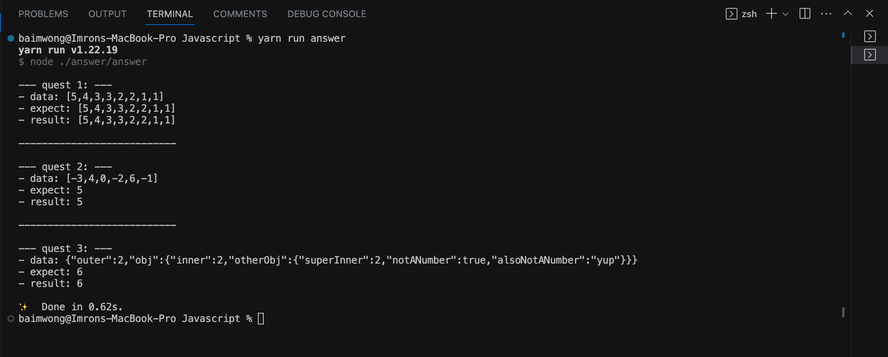
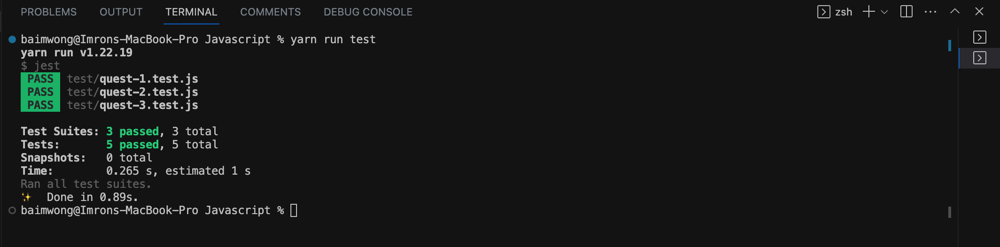

# Intruction for running this program

Please follow this instruction for running program well

## Requirement

- Node Js

## Instalation

Clone repo:

```bash
  git clone https://github.com/irosadie/keda-tech-algorithm.git keda-tech-test
```

Install dependencies

```bash
  cd keda-tech-test && yarn
```

## Running

Running answer:

```bash
  npm run answer
```



Running unit test :

```bash
  npm run test
```


